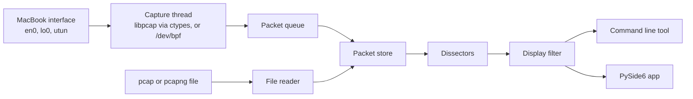

# pilotfish

A packet capture and protocol analyzer for macOS, written from scratch in
Python. pilotfish reads pcap and pcapng files, captures live traffic through
its own ctypes binding to the system libpcap, decodes protocols and filters
what it shows. It has a command line tool and a desktop app built on one
shared core, the same split as tshark and Wireshark.

> **Status:** early development. pilotfish reads pcap and pcapng files and
> captures live traffic; capture filters come next.

## Usage

```console
$ pilotfish read samples/wireshark-wiki/dhcp-nanosecond.pcap
    No.  Time                   Length  Captured  Link type
      1  1102274184.317453000      314       314  ETHERNET
      2  1102274184.317748000      342       342  ETHERNET
      3  1102274184.387484000      314       314  ETHERNET
      4  1102274184.387798000      342       342  ETHERNET
```

`--time-format utc` shows dates instead of epoch seconds. Packets from pcapng
Simple Packet Blocks, which carry no timestamp, show `-`.

### Live capture

```console
$ sudo .venv/bin/pilotfish capture -i en0
Capturing on en0 (Wi-Fi)
    No.  Time                   Length  Captured  Link type
      1  1790090610.599361000       78        78  ETHERNET
      2  1790090610.685196000       74        74  ETHERNET
      3  1790090610.685406000       66        66  ETHERNET
^C
85215 packets captured
85215 packets received by filter
0 packets dropped by kernel
0 packets dropped by pilotfish (queue full)
```

Packets are listed as they arrive until you press Ctrl+C. The first Ctrl+C
stops capturing and still lists the packets already captured; a second one
skips those. The report at the end uses tcpdump's wording, plus the packets
pilotfish itself dropped because the display fell behind. `-c 100` stops after
100 packets. `pilotfish capture --help` lists the other options: snapshot
length, promiscuous mode, buffer size, immediate mode and queue size.

`pilotfish interfaces` lists what you can capture on, with the names System
Settings uses. On a MacBook, en0 is usually the Wi-Fi card, lo0 is loopback,
and utun interfaces are tunnels used by VPNs and some macOS services. Without
`-i`, pilotfish captures on the first connected interface in that list.

On Wi-Fi you'll mostly see your own Mac's traffic plus broadcast and
multicast. That's normal: the Wi-Fi card passes up only frames addressed to
this Mac, and on WPA2 and WPA3 networks each device's traffic is encrypted
with its own key.

`--backend bpf` skips libpcap and reads `/dev/bpf` directly, parsing each
`bpf_hdr` record itself. It sees the same packets as the default libpcap
backend.

#### Permissions

Capturing reads from the `/dev/bpf*` devices, which only root can open by
default, so for now run pilotfish with sudo. Run the virtual environment's
script directly, as above: `sudo uv run` would run uv as root and could leave
root-owned files in `.venv`. Phase 14 removes the need for sudo the way
Wireshark does.

## Architecture



Live capture and saved files both feed one packet store. Everything after it
is shared by the command line tool and the desktop app.

Live capture runs on its own thread. The thread spends most of its time
waiting inside `pcap_next_ex`, and ctypes releases the GIL for the whole call,
so the rest of the program keeps running. Packets reach the display through a
bounded queue. When the display can't keep up, new packets are dropped and
counted instead of making the capture thread wait, which would only move the
loss into the kernel's buffer, where it's harder to see.

| Path | Contents |
|---|---|
| `src/pilotfish/core/` | Capture, decoding, filters and file formats. Standard library only. |
| `src/pilotfish/core/capture/` | The ctypes binding to libpcap, the direct `/dev/bpf` reader and the capture thread |
| `src/pilotfish/cli/` | Command line tool |
| `src/pilotfish/gui/` | PySide6 desktop app |
| `tests/` | pytest and Hypothesis tests |
| `samples/` | Capture files for tests, each with answer keys from tshark and capinfos |
| `scripts/` | Development tools, such as the answer key recorder |

The core never imports the command line tool, the GUI or a third-party packet
library. `tests/test_architecture.py` fails the build if it does. scapy, dpkt
and pyshark may appear in tests only, as a second opinion on the decoder.

## Development

You need macOS, Python 3.12 or newer, and [uv](https://docs.astral.sh/uv/).

```sh
uv sync --all-extras        # create .venv with the GUI extra and dev tools
uv run pilotfish --version
uv run pytest
uv run ruff check
uv run ruff format --check
uv run mypy
```

The live capture tests capture only on lo0, using traffic they send
themselves. They need access to `/dev/bpf*` and are skipped without it.

pilotfish's output is checked against `tshark` and `capinfos`, which come with
Wireshark's command line tools (`brew install wireshark`). Their output for
each sample is saved beside it, so the tests don't need them; see
[samples/README.md](samples/README.md) to add a capture.

## Roadmap

Stage 1: Capture

- [x] Phase 1: project setup
- [x] Phase 2: read pcap and pcapng files
- [x] Phase 3: capture live traffic through libpcap
- [ ] Phase 4: capture filters

## Capture responsibly

Only capture traffic on your own devices and networks, or on networks you have
written permission to monitor. Recording other people's traffic can break
wiretap laws.

## Trademarks

pilotfish is an independent project and is not affiliated with or endorsed by
the Wireshark Foundation. Wireshark and the "fin" logo are registered
trademarks of the Wireshark Foundation. pilotfish contains no Wireshark source
code; Wireshark's public documentation is used as a reference.
