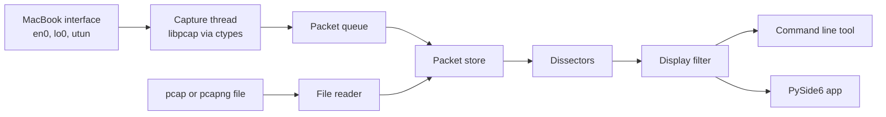

# pilotfish

A packet capture and protocol analyzer for macOS, written from scratch in
Python. pilotfish reads pcap and pcapng files, captures live traffic through
its own ctypes binding to the system libpcap, decodes protocols and filters
what it shows. It has a command line tool and a desktop app built on one
shared core, the same split as tshark and Wireshark.

> **Status:** early development. The project is set up, but nothing reads or
> captures packets yet.

## Architecture



Live capture and saved files both feed one packet store. Everything after it
is shared by the command line tool and the desktop app.

| Path | Contents |
|---|---|
| `src/pilotfish/core/` | Capture, decoding, filters and file formats. Standard library only. |
| `src/pilotfish/cli/` | Command line tool |
| `src/pilotfish/gui/` | PySide6 desktop app |
| `tests/` | pytest and Hypothesis tests |
| `samples/` | Capture files for tests |

The core never imports the command line tool, the GUI or a third-party packet
library. `tests/test_architecture.py` fails the build if it does. scapy, dpkt
and pyshark may appear in tests only, as a second opinion on the decoder.

## Development

You need macOS, Python 3.12 or newer, and [uv](https://docs.astral.sh/uv/).

```sh
uv sync --all-extras        # create .venv with the GUI extra and dev tools
uv run pilotfish --version
uv run pytest
uv run ruff check
uv run ruff format --check
uv run mypy
```

pilotfish's output is checked against `tshark` and `capinfos`, which come with
Wireshark's command line tools (`brew install wireshark`).

## Roadmap

Stage 1: Capture

- [x] Phase 1: project setup
- [ ] Phase 2: read pcap and pcapng files
- [ ] Phase 3: capture live traffic through libpcap
- [ ] Phase 4: capture filters

## Capture responsibly

Only capture traffic on your own devices and networks, or on networks you have
written permission to monitor. Recording other people's traffic can break
wiretap laws.

## Trademarks

pilotfish is an independent project and is not affiliated with or endorsed by
the Wireshark Foundation. Wireshark and the "fin" logo are registered
trademarks of the Wireshark Foundation. pilotfish contains no Wireshark source
code; Wireshark's public documentation is used as a reference.
