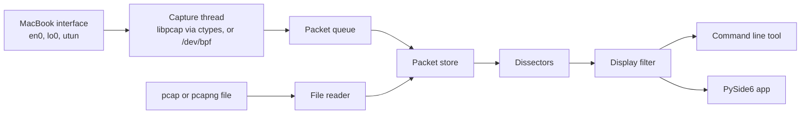

# pilotfish

A packet capture and protocol analyzer for macOS, written from scratch in
Python. pilotfish reads pcap and pcapng files, captures live traffic through
its own ctypes binding to the system libpcap, decodes protocols and filters
what it shows. It has a command line tool and a desktop app built on one
shared core, the same split as tshark and Wireshark.

> **Status:** early development. pilotfish reads pcap and pcapng files,
> captures live traffic and filters it; decoding protocols comes next.

## Usage

```console
$ pilotfish read samples/wireshark-wiki/dhcp-nanosecond.pcap
    No.  Time                   Length  Captured  Link type
      1  1102274184.317453000      314       314  ETHERNET
      2  1102274184.317748000      342       342  ETHERNET
      3  1102274184.387484000      314       314  ETHERNET
      4  1102274184.387798000      342       342  ETHERNET
```

`--time-format utc` shows dates instead of epoch seconds. Packets from pcapng
Simple Packet Blocks, which carry no timestamp, show `-`.

### Live capture

```console
$ sudo .venv/bin/pilotfish capture -i en0
Capturing on en0 (Wi-Fi)
    No.  Time                   Length  Captured  Link type
      1  1790090610.599361000       78        78  ETHERNET
      2  1790090610.685196000       74        74  ETHERNET
      3  1790090610.685406000       66        66  ETHERNET
^C
85215 packets captured
85215 packets received by filter
0 packets dropped by kernel
0 packets dropped by pilotfish (queue full)
```

Packets are listed as they arrive until you press Ctrl+C. The first Ctrl+C
stops capturing and still lists the packets already captured; a second one
skips those. The report at the end uses tcpdump's wording, plus the packets
pilotfish itself dropped because the display fell behind. `-c 100` stops after
100 packets. `pilotfish capture --help` lists the other options: snapshot
length, promiscuous mode, buffer size, immediate mode and queue size.

`pilotfish interfaces` lists what you can capture on, with the names System
Settings uses. On a MacBook, en0 is usually the Wi-Fi card, lo0 is loopback,
and utun interfaces are tunnels used by VPNs and some macOS services. Without
`-i`, pilotfish captures on the first connected interface in that list.

On Wi-Fi you'll mostly see your own Mac's traffic plus broadcast and
multicast. That's normal: the Wi-Fi card passes up only frames addressed to
this Mac, and on WPA2 and WPA3 networks each device's traffic is encrypted
with its own key.

`--backend bpf` skips libpcap and reads `/dev/bpf` directly, parsing each
`bpf_hdr` record itself. It sees the same packets as the default libpcap
backend.

#### Permissions

Capturing reads from the `/dev/bpf*` devices, which only root can open by
default, so for now run pilotfish with sudo. Run the virtual environment's
script directly, as above: `sudo uv run` would run uv as root and could leave
root-owned files in `.venv`. Phase 14 removes the need for sudo the way
Wireshark does.

### Capture filters

`-f` takes a filter in libpcap's syntax, the same one tcpdump and Wireshark
use:

```console
$ sudo .venv/bin/pilotfish capture -i en8 -f 'udp port 53' -c 4
Capturing on en8 (USB 10/100/1000 LAN), filter "udp port 53"
    No.  Time                   Length  Captured  Link type
      1  1790178939.117289000       82        82  ETHERNET
      2  1790178939.136201000      114       114  ETHERNET
      3  1790178939.142002000       81        81  ETHERNET
      4  1790178939.167154000      145       145  ETHERNET
4 packets captured
1008 packets received by filter
0 packets dropped by kernel
0 packets dropped by pilotfish (queue full)
```

The report counts what the filter saw: of the 1008 packets on the interface,
four were DNS.

pilotfish hands the text to libpcap's parser with `pcap_compile` and installs
the result with `pcap_setfilter`. From then on the kernel runs the filter over
every packet the interface sees and wakes pilotfish only for the ones that
match, so what you filtered out costs nothing to skip. A filter that doesn't
compile is reported with libpcap's own message beside the text you wrote:

```console
$ pilotfish capture -f 'udp porrt 53'
pilotfish: capture filter "udp porrt 53": can't parse filter expression: syntax error
```

`pilotfish read -f 'udp port 53' file.pcap` filters a saved file instead.
There is no kernel in that path, so pilotfish runs the compiled program
itself, in [`core/filters/machine.py`](src/pilotfish/core/filters/machine.py).
Packets keep the numbers they have in the file.

#### Looking at the compiled filter

`-d` prints the program, as `tcpdump -d` does. pilotfish reads the
instructions out of the `bpf_insn` array itself and formats them the same way,
so the two can be compared line by line:

```console
$ sudo .venv/bin/pilotfish capture -i en0 -f 'udp port 53' -d
(000) ldh      [12]
(001) jeq      #0x86dd          jt 2	jf 8
(002) ldb      [20]
(003) jeq      #0x11            jt 4	jf 19
(004) ldh      [54]
(005) jeq      #0x35            jt 18	jf 6
(006) ldh      [56]
(007) jeq      #0x35            jt 18	jf 19
(008) jeq      #0x800           jt 9	jf 19
(009) ldb      [23]
(010) jeq      #0x11            jt 11	jf 19
(011) ldh      [20]
(012) jset     #0x1fff          jt 19	jf 13
(013) ldxb     4*([14]&0xf)
(014) ldh      [x + 14]
(015) jeq      #0x35            jt 18	jf 16
(016) ldh      [x + 16]
(017) jeq      #0x35            jt 18	jf 19
(018) ret      #262144
(019) ret      #0
```

The machine running this has an accumulator A, an index register X, and
returns how many bytes of the packet to keep, where 0 means drop it. Jump
targets are absolute instruction numbers, so the program can be read straight
down. Line by line:

- **`(000) ldh [12]`** loads the two bytes 12 into the frame into A. An
  Ethernet header is six bytes of destination address, six of source, then the
  EtherType, so that is the EtherType.
- **`(001) jeq #0x86dd jt 2 jf 8`** compares A with 0x86dd, IPv6. If it
  matches, carry on at instruction 2; if not, jump to 8, which compares it
  with 0x800 for IPv4. Everything else falls through to `ret #0`.
- **`(009) ldb [23]`** takes the single byte 23 into the frame, which is the
  protocol field nine bytes into the IPv4 header, and **`(010)`** checks it
  against 0x11, 17, UDP.
- **`(011) ldh [20]` and `(012) jset #0x1fff jt 19 jf 13`** read the IPv4
  flags and fragment offset and test the offset bits. A fragment that isn't
  the first carries no UDP header, so there are no ports to compare and the
  program jumps to 19 and drops it.
- **`(013) ldxb 4*([14]&0xf)`** puts the length of the IPv4 header into X. The
  low nibble of the header's first byte counts 32-bit words, so four times it
  is the length in bytes. This is what lets the filter cope with a header made
  longer by options.
- **`(014) ldh [x + 14]`** then loads the source port, which is at the start
  of the UDP header, wherever the IPv4 header ended, and `(016)` loads the
  destination port two bytes later. Either one matching 0x35, 53, jumps to 18.
- **`(018) ret #262144`** keeps the packet, up to the snapshot length. That is
  why the snapshot length appears in the program: an accepting return value is
  the number of bytes the kernel copies. **`(019) ret #0`** drops the packet.

The offsets are for Ethernet. Ask for the same filter on lo0 and the program
starts `ld [0]` and compares against an address family instead, because
loopback packets have no Ethernet header in front of them.

## Architecture


```mermaid
flowchart LR
    NIC[MacBook interface<br/>en0, lo0, utun] --> CAP[Capture thread<br/>libpcap via ctypes, or /dev/bpf]
    CAP --> Q[Packet queue]
    FILE[pcap or pcapng file] --> READER[File reader]
    Q --> STORE[Packet store]
    READER --> STORE
    STORE --> DIS[Dissectors]
    DIS --> FILT[Display filter]
    FILT --> CLI[Command line tool]
    FILT --> GUI[PySide6 app]
```

Live capture and saved files both feed one packet store. Everything after it
is shared by the command line tool and the desktop app.

A capture filter is compiled once and left to the kernel, which runs it over
every packet before deciding whether to hand it over. pilotfish has its own
interpreter for the same instructions, which is how a filter can also be
applied to a file.

Live capture runs on its own thread. The thread spends most of its time
waiting inside `pcap_next_ex`, and ctypes releases the GIL for the whole call,
so the rest of the program keeps running. Packets reach the display through a
bounded queue. When the display can't keep up, new packets are dropped and
counted instead of making the capture thread wait, which would only move the
loss into the kernel's buffer, where it's harder to see.

| Path | Contents |
|---|---|
| `src/pilotfish/core/` | Capture, decoding, filters and file formats. Standard library only. |
| `src/pilotfish/core/capture/` | The ctypes binding to libpcap, the direct `/dev/bpf` reader and the capture thread |
| `src/pilotfish/core/filters/` | Compiled capture filters: their instructions, the disassembler and an interpreter |
| `src/pilotfish/cli/` | Command line tool |
| `src/pilotfish/gui/` | PySide6 desktop app |
| `tests/` | pytest and Hypothesis tests |
| `samples/` | Capture files for tests, each with answer keys from tshark and capinfos |
| `scripts/` | Development tools, such as the answer key recorder |

The core never imports the command line tool, the GUI or a third-party packet
library. `tests/test_architecture.py` fails the build if it does. scapy, dpkt
and pyshark may appear in tests only, as a second opinion on the decoder.

## Development

You need macOS, Python 3.12 or newer, and [uv](https://docs.astral.sh/uv/).

```sh
uv sync --all-extras        # create .venv with the GUI extra and dev tools
uv run pilotfish --version
uv run pytest
uv run ruff check
uv run ruff format --check
uv run mypy
```

The live capture tests capture only on lo0, using traffic they send
themselves. They need access to `/dev/bpf*` and are skipped without it.

pilotfish's output is checked against `tshark` and `capinfos`, which come with
Wireshark's command line tools (`brew install wireshark`). Their output for
each sample is saved beside it, so the tests don't need them; see
[samples/README.md](samples/README.md) to add a capture.

## Roadmap

Stage 1: Capture

- [x] Phase 1: project setup
- [x] Phase 2: read pcap and pcapng files
- [x] Phase 3: capture live traffic through libpcap
- [x] Phase 4: capture filters

## Capture responsibly

Only capture traffic on your own devices and networks, or on networks you have
written permission to monitor. Recording other people's traffic can break
wiretap laws.

## Trademarks

pilotfish is an independent project and is not affiliated with or endorsed by
the Wireshark Foundation. Wireshark and the "fin" logo are registered
trademarks of the Wireshark Foundation. pilotfish contains no Wireshark source
code; Wireshark's public documentation is used as a reference.
