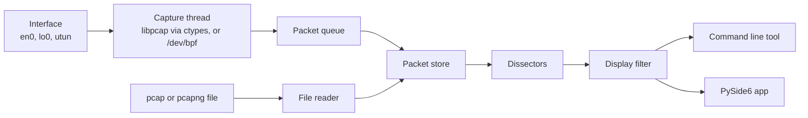

# pilotfish

A packet analyzer for macOS, written from scratch in Python. It captures live
traffic, reads pcap and pcapng files, and decodes what it finds into named
fields — the same job tshark and Wireshark do, built up from the system calls.

No packet libraries are used. The capture path is a hand-written ctypes
binding to macOS's libpcap, the file readers and every protocol decoder are
plain standard-library Python, and the results are checked field by field
against real tshark output.

**Status:** captures, filters and decodes from the link layer up to DNS, DHCP,
HTTP, TLS and SSH, puts messages that span packets back together, follows a
TCP stream from end to end, and picks packets out with display filters in
Wireshark's syntax.

## Install

macOS, Python 3.12+, and [uv](https://docs.astral.sh/uv/):

```sh
git clone https://github.com/abdeltaehass/WireShark_Replica.git
cd WireShark_Replica
uv sync --all-extras
uv run pilotfish --version
```

## Reading a file

```console
$ uv run pilotfish read samples/wireshark-wiki/dns.cap
    No.  Time                  Source                 Destination            Protocol  Length  Info
      1  1112172466.496046000  192.168.170.8          192.168.170.20         DNS           70  Standard query 0x1032 TXT google.com
      2  1112172466.496576000  192.168.170.20         192.168.170.8          DNS           98  Standard query response 0x1032 TXT google.com TXT
      3  1112172470.501268000  192.168.170.8          192.168.170.20         DNS           70  Standard query 0xf76f MX google.com
```

The columns are tshark's: who sent it, who to, the innermost protocol
decoded, and a one-line summary. A packet that doesn't hold what its headers
claim is listed with `[Malformed Packet]` instead of being dropped.

Useful flags:

| Flag | What it does |
|---|---|
| `-V` | print each packet's full protocol tree |
| `-Y 'tcp.port == 443'` | list only the packets a display filter matches |
| `-f 'udp port 53'` | keep only the packets a capture filter matches |
| `--time-format utc` | dates instead of epoch seconds |

`-V` prints a tree like Wireshark's detail pane:

```console
$ uv run pilotfish read -V samples/made/mdns.pcap
Frame 1: 111 bytes on wire, 111 bytes captured
    Frame number: 1
    ...
Multicast Domain Name System (query)
    Transaction ID: 0x0000
    Flags: 0x0000
        Response: Not set
        Opcode: 0
        Truncated: Not set
        Recursion desired: Not set
    Questions: 2
    Answer RRs: 0
    Name: _airplay._tcp.local
        Name Length: 19
        Label Count: 3
    Type: 12
    Class: 0x0001
```

`uv run pilotfish fields` lists all 464 field names it can decode, with their
types. They are Wireshark's names, so `ip.src`, `tcp.flags` and
`dns.qry.name` mean here what they mean there.

## Capturing live traffic

```console
$ sudo .venv/bin/pilotfish capture -i lo0 -c 4
Capturing on lo0 (Loopback)
    No.  Time                  Source                 Destination            Protocol  Length  Info
      1  1790784020.718730000  127.0.0.1              127.0.0.1              ICMP          88  Echo (ping) request  id=0x9294, seq=0
      2  1790784020.718763000  127.0.0.1              127.0.0.1              ICMP          88  Echo (ping) reply  id=0x9294, seq=0
      3  1790784021.022873000  127.0.0.1              127.0.0.1              ICMP          88  Echo (ping) request  id=0x9294, seq=1
      4  1790784021.022921000  127.0.0.1              127.0.0.1              ICMP          88  Echo (ping) reply  id=0x9294, seq=1
4 packets captured
4 packets received by filter
0 packets dropped by kernel
0 packets dropped by pilotfish (queue full)
```

- Capturing needs access to `/dev/bpf*`, which is root-only by default, so run
  it with sudo for now. Use the venv's script directly, as above — `sudo uv run`
  would run uv itself as root.
- Ctrl+C stops cleanly and reports what was dropped, in tcpdump's wording.
- `uv run pilotfish interfaces` lists what you can capture on, with the names
  System Settings uses (en0 is usually Wi-Fi, lo0 is loopback, utun are VPN
  tunnels).
- `-c N` stops after N packets. `--backend bpf` skips libpcap and reads
  `/dev/bpf` directly. `pilotfish capture --help` has the rest.

On Wi-Fi you mostly see your own Mac's traffic plus broadcast and multicast.
That's normal: the card only passes up frames addressed to this Mac.

## Capture filters

`-f` takes a filter in libpcap's syntax — the same one tcpdump and Wireshark
use — which is compiled and handed to the kernel, so packets you filtered out
cost nothing:

```console
$ sudo .venv/bin/pilotfish capture -i en8 -f 'udp port 53' -c 4
...
4 packets captured
1008 packets received by filter
```

A filter that doesn't compile is reported with libpcap's own message:

```console
$ uv run pilotfish capture -f 'udp porrt 53'
pilotfish: capture filter "udp porrt 53": can't parse filter expression: syntax error
```

`-d` prints the compiled program the way `tcpdump -d` does, read straight out
of the instruction array:

```console
$ sudo .venv/bin/pilotfish capture -i en0 -f 'udp port 53' -d
(000) ldh      [12]
(001) jeq      #0x86dd          jt 2	jf 8
(002) ldb      [20]
(003) jeq      #0x11            jt 4	jf 19
(004) ldh      [54]
(005) jeq      #0x35            jt 18	jf 6
...
(018) ret      #262144
(019) ret      #0
```

Reading it: load the EtherType two bytes in (000) and check it for IPv6
(001), then the next header (002) for UDP (003), then the ports (004, 006)
for 53 — and either keep the packet up to the snapshot length (018) or drop
it (019). Jump targets are absolute, so it reads straight down.

The same program runs over saved files too, interpreted in Python, so
`pilotfish read -f ...` filters a capture file the same way.

## Display filters

A capture filter sees raw bytes and decides what is captured at all. A display
filter runs after decoding, so it can ask about anything a dissector worked
out, by field name, in the syntax Wireshark uses:

```console
$ uv run pilotfish read samples/wireshark-wiki/dns.cap -Y 'dns.flags.response == 1 and dns.qry.name contains "www"'
    No.  Time                  Source                 Destination            Protocol  Length  Info
     10  1112172558.734862000  192.168.170.20         192.168.170.8          DNS           90  Standard query response 0x75c0 A www.netbsd.org A 204.152.190.12
     12  1112172575.698849000  192.168.170.20         192.168.170.8          DNS          102  Standard query response 0xf0d4 AAAA www.netbsd.org AAAA 2001:4f8:4:7:2e0:81ff:fe52:9a6b
     14  1112172635.523827000  192.168.170.20         192.168.170.8          DNS          102  Standard query response 0x7f39 AAAA www.netbsd.org AAAA 2001:4f8:4:7:2e0:81ff:fe52:9a6b
     16  1112172644.752428000  192.168.170.20         192.168.170.8          DNS           94  Standard query response 0x8db3 AAAA www.google.com CNAME www.l.google.com
     18  1112172654.366527000  192.168.170.20         192.168.170.8          DNS           76  Standard query response 0xdca2 AAAA www.l.google.com
     20  1112172695.437491000  192.168.170.20         192.168.170.8          DNS           75  Standard query response 0xbc1f AAAA www.example.com
     22  1112172707.032976000  192.168.170.20         192.168.170.8          DNS           79  Standard query response 0x266d No such name AAAA www.example.notginh
     24  1112172737.733384000  192.168.170.20         192.168.170.8          DNS          115  Standard query response 0xfee3 ANY www.isc.org AAAA 2001:4f8:0:2::d A 204.152.184.88
```

| Filter | Matches |
|---|---|
| `dns` | packets that have the protocol, or the field, at all |
| `tcp.port >= 1024` | a comparison: `==` `!=` `<` `<=` `>` `>=`, or `eq` `ne` `lt` `le` `gt` `ge` |
| `tcp and not (http or tls)` | `and` `or` `xor` `not`, or `&&` `\|\|` `^^` `!`, with brackets |
| `ip.addr == 192.168.0.0/16` | either address inside a subnet |
| `tcp.port in {80, 443, 8000..8080}` | any of a set of values and ranges, commas optional |
| `http.host contains "example"` | text or bytes holding something |
| `http.request.uri matches "\\.php$"` | a regular expression, ignoring case |
| `eth.src[0:3] == 00:1a:2b` | a slice of a field's bytes: `[2]` `[0:3]` `[0-2]` `[-4:]` `[0,5]` |
| `frame contains "password"` | anywhere in the packet, or in one protocol's bytes with `tcp contains` |
| `tcp.flags & 0x12 == 0x12` | bits picked out with a mask |
| `len(http.host) > 40`, `count(dns.a) > 1` | `len`, `count`, `lower` and `upper` |
| `frame.time_epoch >= "2023-11-14 22:13:20"` | times, as seconds or as a UTC date |

A packet has two addresses and two ports, so a field such as `ip.addr` or
`tcp.port` stands for either. `ip.addr == 10.0.0.1` is true if either is, and
`ip.addr != 10.0.0.1` only if neither is, which is what Wireshark 4 decided
those should mean. `===` and `!==` ask the other way round.

A filter that is wrong says what is wrong and points at it:

```console
$ uv run pilotfish read samples/wireshark-wiki/http.cap -Y 'ip.src == 145.254.160.300'
pilotfish: display filter: ip.src is an IPv4 address, and 300 is too large for a part of one: each is 0 to 255
    ip.src == 145.254.160.300
                          ^~~
$ uv run pilotfish read samples/wireshark-wiki/http.cap -Y 'tcp.prot == 80'
pilotfish: display filter: no field is named "tcp.prot"; did you mean "tcp.port"?
    tcp.prot == 80
    ^~~~~~~~
$ uv run pilotfish read samples/wireshark-wiki/http.cap -Y 'http.host matches "ethereal(\\.com"'
pilotfish: display filter: this regular expression doesn't compile: missing ), unterminated subpattern
    http.host matches "ethereal(\\.com"
                               ^
```

It is a small compiler, in four stages:

1. A **lexer** cuts the text into tokens that remember where they were
   written. `80`, `tcp.port` and `192.168.0.0/16` are all just words at this
   point, because what a word is depends on what it is compared with.
2. A hand-written **Pratt parser** builds a syntax tree. One loop and a table
   of binding powers handle all the precedence: `or`, then `xor`, then `and`,
   then `not`, then comparisons.
3. A **type checker** looks every word up in the field registry. A word that
   names a field is a field; anything else is a value, and is read as the type
   of the field beside it. That is where `ip.src == hello` stops, and where a
   port can't `contains` anything.
4. The typed tree is then run. An **evaluator** walks it for each packet, and a
   **code generator** turns it into a Python function with the `ast` module and
   `compile()`.

`pilotfish filter` shows the middle of that without reading a capture:

```console
$ uv run pilotfish filter 'tcp.port == 80 and not dns'
Parsed as    (and (== tcp.port 80) (not dns))
Looks up     dns, tcp.dstport, tcp.srcport
Compiled to  lambda found, data: any((n0.value == 80 for n0 in found['tcp.srcport'] + found['tcp.dstport'])) and (not found['dns'] != [])
```

The generated function gives the same answer as the tree walk, and gets
there between 2.7 and 9.6 times faster over the twelve filters in
`scripts/benchmark_display_filters.py`, 7 times at the median: about 0.2
microseconds a packet instead of 1.5. What it saves is the deciding, done
again for every packet, of what kind of node each one is. Both ways first
find the filter's fields in the packet's tree, which takes about 2
microseconds and is now most of what filtering costs. Decoding the packet in
the first place takes about 60.

The function is built as a Python syntax tree, never as source text, so
nothing typed into a filter can run as code: its values go in as constants and
its field names as dictionary keys.

The suite has 466 filters of its own: 306 that are right, each with the
packets it has to match, and 160 that are wrong, each with the message it has
to give and the characters it has to point at.

What a filter means is Wireshark's to say, so `tshark -Y` was run for 360
filters over every sample capture pilotfish decodes, and its answers are kept
beside them. The tests hold pilotfish to the same packets, filter by filter:
7,200 comparisons over the captures in this repository.

## Following a stream

A file fetched over HTTP arrives as dozens of segments, mixed in with every
other connection, some of them late and some sent twice. `follow` puts one
connection's bytes back in the order they were sent and prints what each end
said:

```console
$ uv run pilotfish follow samples/made/http-download.pcap 0
TCP stream 0
client  192.0.2.1:50010
server  192.0.2.2:80

client > server, 63 bytes
GET /pilotfish.bin HTTP/1.1
Host: example.com
Accept: */*


server > client, 20101 bytes
HTTP/1.1 200 OK
Server: pilotfish
Content-Type: application/octet-stream
Content-Length: 20000
...
```

The number is the stream index `read -V` shows for each TCP packet. `--raw
client` or `--raw server` writes one end's bytes exactly as they were sent,
which is how to check that a download comes back whole. In that capture the
fourth segment of the file overtakes the third and the last is sent twice,
and the file is still rebuilt byte for byte:

```console
$ uv run pilotfish follow samples/made/http-download.pcap 0 --raw server \
    | tail -c +102 | head -c 20000 | shasum -a 256
4cfd36429b493d7232195a49be8270f51031a8bcc0878052b4c753eff45b9b85  -
```

(`tail` skips the 101 bytes of headers, and `head` stops before the next
response on the same connection.) That digest is the SHA-256 of the file the
capture was built to carry, and a test holds pilotfish to it.

## What it decodes

| Layer | Protocols |
|---|---|
| Link | Ethernet II, 802.1Q VLAN, BSD loopback, raw IP |
| Network | IPv4 (options, fragments), IPv6 (extension headers, fragments), ARP |
| Control | ICMP, ICMPv6 including neighbour discovery |
| Transport | UDP, TCP with options, connection tracking and Wireshark's analysis |
| Application | DNS, mDNS, DHCP, HTTP/1.1, TLS, SSH |

Some of what that gives you:

- **Checksums** are verified and reported as good, bad or unverified, over a
  pseudo header where the protocol uses one. A half-finished checksum left by
  a network card is read as offloading rather than damage.
- **TCP** sequence numbers are counted from the start of their own connection,
  and each segment is judged the way Wireshark judges it: retransmission, fast
  or spurious retransmission, out-of-order, lost segment, duplicate ACK, zero
  window with its probe and answer, keep-alive, window full, window update.
- **DNS** follows compression pointers safely — a message is free to point a
  name at itself, so every pointer has to lead strictly backwards — and ties
  each response back to the question it answers.
- **TLS** decodes the handshake that happens before encryption starts: the
  versions, ciphers, extensions and the server name the client asked for, plus
  JA3 and JA3S fingerprints of the hello.
- **SSH** decodes the greeting and the algorithms each end offers, with the
  HASSH fingerprint, then reports the size and direction of packets whose
  contents are encrypted.
- **Messages that span packets** are decoded once, whole, in the packet that
  completes them, as Wireshark does it. Fragmented IPv4 and IPv6 datagrams
  are put back together, and each direction of a TCP connection is put back
  in sequence whatever order its segments arrived in, with bytes that were
  sent twice counted once. An HTTP body that was sent in chunks or compressed
  is given back as the file it carried.

```console
$ uv run pilotfish read samples/made/tcp.pcap
      5  1700000000.040000000  192.0.2.1  192.0.2.2  TCP  154  [TCP Previous segment not captured] 50000 → 80 [PSH, ACK] Seq=301 Ack=1 Win=8000 Len=100
      6  1700000000.041000000  192.0.2.1  192.0.2.2  TCP  154  [TCP Retransmission] 50000 → 80 [PSH, ACK] Seq=101 Ack=1 Win=8000 Len=100
     11  1700000000.160000000  192.0.2.2  192.0.2.1  TCP   54  [TCP Dup ACK 8#2] 80 → 50000 [ACK] Seq=1 Ack=401 Win=8000 Len=0
```

(The columns are trimmed here to fit; the real ones line up.)

A packet that only carries part of a message says so, and the message
appears where its last byte does:

```console
$ uv run pilotfish read samples/wireshark-wiki/http.cap
     34  ...  TCP   1434  80 → 3372 [ACK] Seq=16561 Ack=480 Win=6432 Len=1380 [TCP segment of a reassembled PDU]
     38  ...  HTTP   478  HTTP/1.1 200 OK  (text/html)
```

## How it works


```mermaid
flowchart LR
    NIC[Interface<br/>en0, lo0, utun] --> CAP[Capture thread<br/>libpcap via ctypes, or /dev/bpf]
    CAP --> Q[Packet queue]
    FILE[pcap or pcapng file] --> READER[File reader]
    Q --> STORE[Packet store]
    READER --> STORE
    STORE --> DIS[Dissectors]
    DIS --> FILT[Display filter]
    FILT --> CLI[Command line tool]
    FILT --> GUI[PySide6 app]
```

- **Reading bytes.** Every dissector reads through a bounds-checked buffer.
  Running off the end raises one error the engine catches, so a truncated or
  lying packet is marked and kept, never a crash.
- **Naming fields.** Each read names the field it is reading, so every value
  in the tree carries its name, type and the exact bytes it came from.
- **Finding the next protocol.** A dissector ends by naming a table and a
  value — an EtherType, an IP protocol number, a port — and the registry turns
  that into the next dissector. Protocols never call each other directly. When
  no port matches, the heuristics are asked, which is how HTTP on an odd port
  is still recognised.
- **Remembering.** Dissectors hold no state between packets. Anything that has
  to outlive one — TCP connections, DNS questions waiting for answers — lives
  in a per-capture session.
- **Waiting for the rest.** TCP delivers a stream, not messages, so a
  dissector that finds a message unfinished says how many more bytes it
  needs and is handed the same bytes again once they have arrived. Fields
  decoded from a reassembled message point into the reassembled bytes, the
  way Wireshark opens a second tab beside the frame.
- **Staying small.** Whoever sends the packets chooses what they claim, so
  everything kept for later has a limit: fragments that never complete are
  dropped after thirty seconds or once four megabytes are waiting, a stream
  holds at most sixteen megabytes for an unfinished message, and a compressed
  body is only unpacked so far.
- **Checking.** `tshark -T json` for every sample is recorded beside it, and
  the tests compare every field pilotfish decodes against it — about 33,000
  values in the captures kept here — along with which packet each message
  lands in. Random bytes are fuzzed through every dissector, and segments and
  fragments through reassembly in any order, to prove a bad packet can only
  ever be marked malformed. Display filters are generated at random too, and
  the compiled function has to agree with the tree walk on every one.

| Path | Contents |
|---|---|
| `src/pilotfish/core/capture/` | libpcap binding, `/dev/bpf` reader, capture thread |
| `src/pilotfish/core/filters/` | capture filters: instructions, disassembler, interpreter |
| `src/pilotfish/core/display/` | display filters: lexer, parser, type checker, evaluator, code generator |
| `src/pilotfish/core/dissect/` | the dissector framework |
| `src/pilotfish/core/protocols/` | one module per protocol |
| `src/pilotfish/core/reassembly/` | fragments and TCP streams, put back in order |
| `src/pilotfish/core/follow.py` | following a TCP stream |
| `src/pilotfish/cli/` | command line tool |
| `src/pilotfish/gui/` | PySide6 desktop app |
| `tests/`, `samples/`, `scripts/` | tests, capture files with answer keys, dev tools |

The core is standard library only and never imports the CLI, the GUI or a
third-party packet library; a test fails the build if that changes.

## Development

```sh
uv run pytest                                          # the test suite
uv run ruff check && uv run ruff format --check        # lint and format
uv run mypy                                            # types, strict
uv run pytest tests/test_fuzz.py --hypothesis-profile=fuzz   # longer fuzzing
uv run scripts/benchmark_display_filters.py            # tree walk against compiled
```

Comparing against Wireshark's tools needs `brew install wireshark`, but the
tests don't: their output for each sample is saved in the repo. See
[samples/README.md](samples/README.md) to add a capture.

## Roadmap

**Stage 1: Capture**

- [x] Phase 1: project setup
- [x] Phase 2: read pcap and pcapng files
- [x] Phase 3: capture live traffic through libpcap
- [x] Phase 4: capture filters

**Stage 2: Decoding**

- [x] Phase 5: the dissector framework
- [x] Phase 6: link and network layers
- [x] Phase 7: TCP and UDP
- [x] Phase 8: application protocols
- [x] Phase 9: reassembling fragments and streams

**Stage 3: Filters, command line and files**

- [x] Phase 10: display filters
- [ ] Phase 11: the command line tool
- [ ] Phase 12: saving and exporting files

## Capture responsibly

Only capture traffic on your own devices and networks, or ones you have
written permission to monitor. Recording other people's traffic can break
wiretap laws.

## Trademarks

pilotfish is an independent project, not affiliated with or endorsed by the
Wireshark Foundation. Wireshark and the "fin" logo are registered trademarks
of the Wireshark Foundation. pilotfish contains no Wireshark source code;
Wireshark's public documentation is used as a reference.
