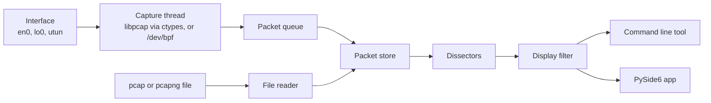

# pilotfish

A packet analyzer for macOS, written from scratch in Python. It captures live
traffic, reads pcap and pcapng files, and decodes what it finds into named
fields — the same job tshark and Wireshark do, built up from the system calls.

No packet libraries are used. The capture path is a hand-written ctypes
binding to macOS's libpcap, the file readers and every protocol decoder are
plain standard-library Python, and the results are checked field by field
against real tshark output.

**Status:** captures, filters and decodes from the link layer up to DNS, DHCP,
HTTP, TLS and SSH. Reassembling messages that span packets is next.

## Install

macOS, Python 3.12+, and [uv](https://docs.astral.sh/uv/):

```sh
git clone https://github.com/abdeltaehass/WireShark_Replica.git
cd WireShark_Replica
uv sync --all-extras
uv run pilotfish --version
```

## Reading a file

```console
$ uv run pilotfish read samples/wireshark-wiki/dns.cap
    No.  Time                  Source                 Destination            Protocol  Length  Info
      1  1112172466.496046000  192.168.170.8          192.168.170.20         DNS           70  Standard query 0x1032 TXT google.com
      2  1112172466.496576000  192.168.170.20         192.168.170.8          DNS           98  Standard query response 0x1032 TXT google.com TXT
      3  1112172470.501268000  192.168.170.8          192.168.170.20         DNS           70  Standard query 0xf76f MX google.com
```

The columns are tshark's: who sent it, who to, the innermost protocol
decoded, and a one-line summary. A packet that doesn't hold what its headers
claim is listed with `[Malformed Packet]` instead of being dropped.

Useful flags:

| Flag | What it does |
|---|---|
| `-V` | print each packet's full protocol tree |
| `-f 'udp port 53'` | keep only matching packets |
| `--time-format utc` | dates instead of epoch seconds |

`-V` prints a tree like Wireshark's detail pane:

```console
$ uv run pilotfish read -V samples/made/mdns.pcap
Frame 1: 111 bytes on wire, 111 bytes captured
    Frame number: 1
    ...
Multicast Domain Name System (query)
    Transaction ID: 0x0000
    Flags: 0x0000
        Response: Not set
        Opcode: 0
        Truncated: Not set
        Recursion desired: Not set
    Questions: 2
    Answer RRs: 0
    Name: _airplay._tcp.local
        Name Length: 19
        Label Count: 3
    Type: 12
    Class: 0x0001
```

`uv run pilotfish fields` lists all 442 field names it can decode, with their
types. They are Wireshark's names, so `ip.src`, `tcp.flags` and
`dns.qry.name` mean here what they mean there.

## Capturing live traffic

```console
$ sudo .venv/bin/pilotfish capture -i lo0 -c 4
Capturing on lo0 (Loopback)
    No.  Time                  Source                 Destination            Protocol  Length  Info
      1  1790784020.718730000  127.0.0.1              127.0.0.1              ICMP          88  Echo (ping) request  id=0x9294, seq=0
      2  1790784020.718763000  127.0.0.1              127.0.0.1              ICMP          88  Echo (ping) reply  id=0x9294, seq=0
      3  1790784021.022873000  127.0.0.1              127.0.0.1              ICMP          88  Echo (ping) request  id=0x9294, seq=1
      4  1790784021.022921000  127.0.0.1              127.0.0.1              ICMP          88  Echo (ping) reply  id=0x9294, seq=1
4 packets captured
4 packets received by filter
0 packets dropped by kernel
0 packets dropped by pilotfish (queue full)
```

- Capturing needs access to `/dev/bpf*`, which is root-only by default, so run
  it with sudo for now. Use the venv's script directly, as above — `sudo uv run`
  would run uv itself as root.
- Ctrl+C stops cleanly and reports what was dropped, in tcpdump's wording.
- `uv run pilotfish interfaces` lists what you can capture on, with the names
  System Settings uses (en0 is usually Wi-Fi, lo0 is loopback, utun are VPN
  tunnels).
- `-c N` stops after N packets. `--backend bpf` skips libpcap and reads
  `/dev/bpf` directly. `pilotfish capture --help` has the rest.

On Wi-Fi you mostly see your own Mac's traffic plus broadcast and multicast.
That's normal: the card only passes up frames addressed to this Mac.

## Filters

`-f` takes a filter in libpcap's syntax — the same one tcpdump and Wireshark
use — which is compiled and handed to the kernel, so packets you filtered out
cost nothing:

```console
$ sudo .venv/bin/pilotfish capture -i en8 -f 'udp port 53' -c 4
...
4 packets captured
1008 packets received by filter
```

A filter that doesn't compile is reported with libpcap's own message:

```console
$ uv run pilotfish capture -f 'udp porrt 53'
pilotfish: capture filter "udp porrt 53": can't parse filter expression: syntax error
```

`-d` prints the compiled program the way `tcpdump -d` does, read straight out
of the instruction array:

```console
$ sudo .venv/bin/pilotfish capture -i en0 -f 'udp port 53' -d
(000) ldh      [12]
(001) jeq      #0x86dd          jt 2	jf 8
(002) ldb      [20]
(003) jeq      #0x11            jt 4	jf 19
(004) ldh      [54]
(005) jeq      #0x35            jt 18	jf 6
...
(018) ret      #262144
(019) ret      #0
```

Reading it: load the EtherType two bytes in (000) and check it for IPv6
(001), then the next header (002) for UDP (003), then the ports (004, 006)
for 53 — and either keep the packet up to the snapshot length (018) or drop
it (019). Jump targets are absolute, so it reads straight down.

The same program runs over saved files too, interpreted in Python, so
`pilotfish read -f ...` filters a capture file the same way.

## What it decodes

| Layer | Protocols |
|---|---|
| Link | Ethernet II, 802.1Q VLAN, BSD loopback, raw IP |
| Network | IPv4 (options, fragmentation), IPv6 (extension headers), ARP |
| Control | ICMP, ICMPv6 including neighbour discovery |
| Transport | UDP, TCP with options, connection tracking and Wireshark's analysis |
| Application | DNS, mDNS, DHCP, HTTP/1.1, TLS, SSH |

Some of what that gives you:

- **Checksums** are verified and reported as good, bad or unverified, over a
  pseudo header where the protocol uses one. A half-finished checksum left by
  a network card is read as offloading rather than damage.
- **TCP** sequence numbers are counted from the start of their own connection,
  and each segment is judged the way Wireshark judges it: retransmission, fast
  or spurious retransmission, out-of-order, lost segment, duplicate ACK, zero
  window with its probe and answer, keep-alive, window full, window update.
- **DNS** follows compression pointers safely — a message is free to point a
  name at itself, so every pointer has to lead strictly backwards — and ties
  each response back to the question it answers.
- **TLS** decodes the handshake that happens before encryption starts: the
  versions, ciphers, extensions and the server name the client asked for, plus
  JA3 and JA3S fingerprints of the hello.
- **SSH** decodes the greeting and the algorithms each end offers, with the
  HASSH fingerprint, then reports the size and direction of packets whose
  contents are encrypted.

```console
$ uv run pilotfish read samples/made/tcp.pcap
      5  1700000000.040000000  192.0.2.1  192.0.2.2  TCP  154  [TCP Previous segment not captured] 50000 → 80 [PSH, ACK] Seq=301 Ack=1 Win=8000 Len=100
      6  1700000000.041000000  192.0.2.1  192.0.2.2  TCP  154  [TCP Retransmission] 50000 → 80 [PSH, ACK] Seq=101 Ack=1 Win=8000 Len=100
     11  1700000000.160000000  192.0.2.2  192.0.2.1  TCP   54  [TCP Dup ACK 8#2] 80 → 50000 [ACK] Seq=1 Ack=401 Win=8000 Len=0
```

(The columns are trimmed here to fit; the real ones line up.)

## How it works


```mermaid
flowchart LR
    NIC[Interface<br/>en0, lo0, utun] --> CAP[Capture thread<br/>libpcap via ctypes, or /dev/bpf]
    CAP --> Q[Packet queue]
    FILE[pcap or pcapng file] --> READER[File reader]
    Q --> STORE[Packet store]
    READER --> STORE
    STORE --> DIS[Dissectors]
    DIS --> FILT[Display filter]
    FILT --> CLI[Command line tool]
    FILT --> GUI[PySide6 app]
```

- **Reading bytes.** Every dissector reads through a bounds-checked buffer.
  Running off the end raises one error the engine catches, so a truncated or
  lying packet is marked and kept, never a crash.
- **Naming fields.** Each read names the field it is reading, so every value
  in the tree carries its name, type and the exact bytes it came from.
- **Finding the next protocol.** A dissector ends by naming a table and a
  value — an EtherType, an IP protocol number, a port — and the registry turns
  that into the next dissector. Protocols never call each other directly. When
  no port matches, the heuristics are asked, which is how HTTP on an odd port
  is still recognised.
- **Remembering.** Dissectors hold no state between packets. Anything that has
  to outlive one — TCP connections, DNS questions waiting for answers — lives
  in a per-capture session.
- **Checking.** `tshark -T json` for every sample is recorded beside it, and
  the tests compare every field pilotfish decodes against it — about 47,000
  values. Random bytes are fuzzed through every dissector to prove a bad
  packet can only ever be marked malformed.

| Path | Contents |
|---|---|
| `src/pilotfish/core/capture/` | libpcap binding, `/dev/bpf` reader, capture thread |
| `src/pilotfish/core/filters/` | capture filters: instructions, disassembler, interpreter |
| `src/pilotfish/core/dissect/` | the dissector framework |
| `src/pilotfish/core/protocols/` | one module per protocol |
| `src/pilotfish/cli/` | command line tool |
| `src/pilotfish/gui/` | PySide6 desktop app |
| `tests/`, `samples/`, `scripts/` | tests, capture files with answer keys, dev tools |

The core is standard library only and never imports the CLI, the GUI or a
third-party packet library; a test fails the build if that changes.

## Development

```sh
uv run pytest                                          # the test suite
uv run ruff check && uv run ruff format --check        # lint and format
uv run mypy                                            # types, strict
uv run pytest tests/test_fuzz.py --hypothesis-profile=fuzz   # longer fuzzing
```

Comparing against Wireshark's tools needs `brew install wireshark`, but the
tests don't: their output for each sample is saved in the repo. See
[samples/README.md](samples/README.md) to add a capture.

## Roadmap

**Stage 1: Capture**

- [x] Phase 1: project setup
- [x] Phase 2: read pcap and pcapng files
- [x] Phase 3: capture live traffic through libpcap
- [x] Phase 4: capture filters

**Stage 2: Decoding**

- [x] Phase 5: the dissector framework
- [x] Phase 6: link and network layers
- [x] Phase 7: TCP and UDP
- [x] Phase 8: application protocols
- [ ] Phase 9: reassembling fragments and streams

## Capture responsibly

Only capture traffic on your own devices and networks, or ones you have
written permission to monitor. Recording other people's traffic can break
wiretap laws.

## Trademarks

pilotfish is an independent project, not affiliated with or endorsed by the
Wireshark Foundation. Wireshark and the "fin" logo are registered trademarks
of the Wireshark Foundation. pilotfish contains no Wireshark source code;
Wireshark's public documentation is used as a reference.
